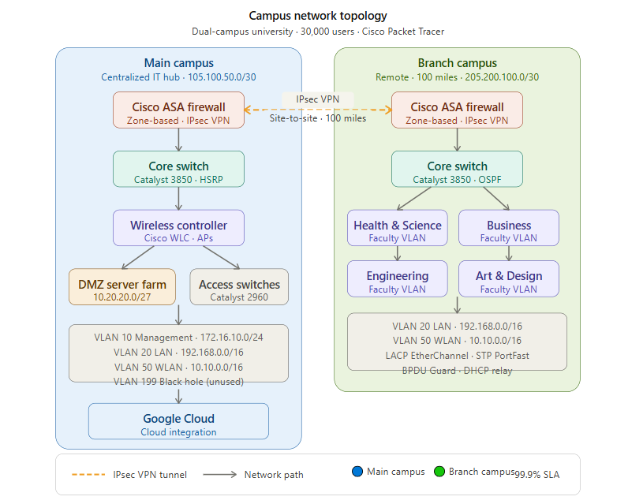
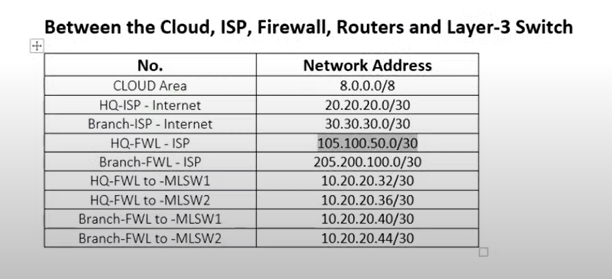

# 🏛️ Secure Campus Network System

[](https://github.com)
[](https://cisco.com)
[](https://github.com)
[](https://github.com)

## 📋 Project Overview

A comprehensive **enterprise-grade network infrastructure** designed for a dual-campus university system supporting 
30,000+ users with projected growth to 60,000 by 2025. This Master's degree project demonstrates advanced network 
design principles, enterprise security implementation, and scalable infrastructure planning following Cisco best 
practices and industry standards.

### 🎯 Key Features

- **🏢 Dual Campus Architecture** - Two campuses connected via secure IPsec VPN
- **🛡️ Enterprise Security** - Cisco ASA firewalls with zone-based security policies
- **📶 Centralized Wireless** - Cisco WLC managing distributed access points
- **🔄 High Availability** - HSRP, redundant DHCP, and EtherChannel implementation
- **☁️ Cloud Integration** - Google Cloud platform connectivity
- **🏗️ Hierarchical Design** - 3-tier architecture for optimal scalability

## 🏗️ Network Architecture

### Campus Infrastructure

- **Main Campus**: Centralized IT hub with server farm (DMZ)
- **Branch Campus**: Remote location 100 miles from main campus
- **Faculties**: Health & Sciences, Business, Engineering/Computing, Art/Design

### Technical Specifications

- **Current Users**: 30,000 across both campuses
- **Projected Growth**: 60,000 users by 2025
- **Network Segments**: 4 VLANs with dedicated security zones
- **Connectivity**: Site-to-site VPN with 99.9% uptime SLA

## 🌐 Network Topology





## 📊 IP Addressing Scheme

| Network Type | IP Range | Hosts | Purpose |
|-------------|----------|-------|---------|
| **Management** | `172.16.10.0/24` | 254 | Network management |
| **WLAN** | `10.10.0.0/16` | 65,534 | Wireless clients |
| **LAN** | `192.168.0.0/16` | 65,534 | Wired clients |
| **DMZ** | `10.20.20.0/27` | 30 | Server farm |
| **Public (Main)** | `105.100.50.0/30` | 2 | Internet connectivity |
| **Public (Branch)** | `205.200.100.0/30` | 2 | Internet connectivity |

## 🔧 Technology Stack

### Network Equipment

- **Firewalls**: Cisco ASA 5500-X Series
- **Core Switches**: Cisco Catalyst 3850 (48-port)
- **Access Switches**: Cisco Catalyst 2960 (48-port)
- **Wireless Controller**: Cisco WLC
- **Access Points**: Cisco Lightweight APs

### Protocols & Standards

- **Routing**: OSPF (Open Shortest Path First)
- **VLAN**: 802.1Q Trunking
- **Security**: IPsec VPN, Zone-based Firewalling
- **High Availability**: HSRP (Hot Standby Router Protocol)
- **Link Aggregation**: LACP EtherChannel

## 🛡️ Security Implementation

### Network Segmentation

```text
VLAN 10  - Management Network
VLAN 20  - LAN Users
VLAN 50  - WLAN Users  
VLAN 199 - Black Hole (Unused Ports)
```

### Security Features

- ✅ **Zone-based Firewall Policies**
- ✅ **IPsec Site-to-Site VPN**
- ✅ **Standard ACLs for SSH Access**
- ✅ **STP PortFast & BPDU Guard**
- ✅ **DMZ Server Isolation**

## 🚀 Implementation Guide

### Phase 1: Infrastructure Setup

1. **Network Design & Documentation**
2. **Basic Device Configuration**
3. **VLAN Implementation**

### Phase 2: Core Services

4. **EtherChannel Configuration**
5. **IP Addressing & Subnetting**
6. **HSRP & Inter-VLAN Routing**

### Phase 3: Advanced Features

7. **DHCP Server Deployment**
8. **OSPF Routing Protocol**
9. **Firewall Security Policies**

### Phase 4: Connectivity & Testing

10. **Wireless Network Setup**
11. **IPsec VPN Configuration**
12. **End-to-end Testing & Validation**

## 📁 Project Structure

```text
secure-campus-network/
├── README.md
├── CONTRIBUTING.md
├── CHANGELOG.md
├── LICENSE
├── docs/
│   ├── design/
│   │   ├── network-requirements.md
│   │   ├── security-design.md
│   │   └── ip-addressing-plan.md
│   ├── implementation/
│   │   ├── configuration-guide.md
│   │   └── testing-procedures.md
│   ├── ARCHITECTURE.md
│   ├── DEPLOYMENT-GUIDE.md
│   └── TROUBLESHOOTING.md
├── assets/
│   ├── images/
│   │   ├── campus-network-topology.png
│   │   ├── inter-campus-connectivity.png
│   │   ├── security-architecture.png
│   │   ├── campus-network.png
│   │   └── network-connectivity-diagram.png
│   └── packet-tracer/
│       └── campus-network-simulation.pkt
├── configs/
│   ├── switches/
│   ├── firewalls/
│   └── wireless/
├── scripts/
│   ├── backup-configs.py
│   └── network-monitoring.py
└── .github/
    └── workflows/
        └── documentation.yml
```

## 🔍 Key Achievements

- ✨ **Scalable Architecture** - Designed for 100% user growth
- ✨ **99.9% Uptime** - Redundant systems and failover mechanisms
- ✨ **Enterprise Security** - Multi-layered defense strategy
- ✨ **Cost Optimization** - Efficient resource utilization
- ✨ **Future-Ready** - Cloud integration and modern protocols

## 🛠️ Tools & Simulation

- **Design Tool**: Cisco Packet Tracer
- **Simulation File**: [Campus Network Design](assets/packet-tracer/campus-network-simulation.pkt)
- **Documentation**: Markdown & Professional Diagrams
- **Version Control**: Git/GitHub
- **Testing**: Network simulation and validation

## 📈 Performance Metrics

- **Network Latency**: < 50ms inter-campus
- **Throughput**: 1Gbps backbone capacity
- **Availability**: 99.9% uptime SLA
- **Security**: Zero-breach architecture design

## 🤝 Contributing

This project represents enterprise network design best practices. We welcome contributions from:

- 🎓 **Students**: Learning network design and implementation
- 👨‍💼 **Professionals**: Sharing industry expertise and improvements  
- 🔧 **Engineers**: Optimizing configurations and adding features
- 📚 **Educators**: Enhancing documentation and learning materials

Please review our [Contributing Guidelines](CONTRIBUTING.md) before submitting contributions.

## 📄 License

This project is licensed under the MIT License - see the [LICENSE](LICENSE) file for details.

## 🤝 How to Contribute

We welcome contributions from network engineers, students, and IT professionals! See our 
[Contributing Guidelines](CONTRIBUTING.md) for details on:

- 🔧 Network design improvements
- 📚 Documentation enhancements  
- 🧪 Testing and validation
- 🛠️ Automation tools

## 📋 Changelog

See [CHANGELOG.md](CHANGELOG.md) for detailed version history and feature updates.

## 📚 Additional Resources

- 📖 [Architecture Documentation](docs/ARCHITECTURE.md) - Detailed system architecture
- 🚀 [Deployment Guide](docs/DEPLOYMENT-GUIDE.md) - Step-by-step deployment
- 🔧 [Troubleshooting Guide](docs/TROUBLESHOOTING.md) - Common issues and solutions
- ⚙️ [Configuration Examples](docs/implementation/configuration-guide.md) - Device configurations

## 🎓 Learning Outcomes

This project demonstrates mastery of:

- **Network Architecture Design**: Hierarchical 3-tier design principles
- **Enterprise Security**: Multi-layered defense strategies
- **High Availability**: Redundancy and failover mechanisms
- **Network Automation**: Scripting and monitoring tools
- **Industry Standards**: Cisco best practices and compliance
- **Project Management**: Documentation and professional presentation

## 🌟 Project Highlights

- ⭐ **Enterprise-Grade**: Production-ready network design
- 🎯 **Scalable**: Supports 100% user growth
- 🔒 **Secure**: Multi-zone security architecture
- 📊 **Monitored**: Comprehensive health checking
- 🤖 **Automated**: Backup and deployment scripts
- 📖 **Documented**: Professional-grade documentation

## 📧 Contact & Support

**Author**: Trabelsi Mohamed Amine  
**Academic Level**: Master's Degree - 2nd Year  
**Project**: Secure Campus Network System  
**Institution**: University Network Infrastructure Project  

For questions or collaboration opportunities:

- 💼 LinkedIn: [Trabelsi Mohamed Amine](https://www.linkedin.com/in/trabelsi-mohamed-amine)
- 🐙 GitHub: [trabelssi](https://github.com/trabelssi)
- 📧 Email: <aminetrabls021@gmail.com>

## 🙏 Acknowledgments

- **Cisco Systems** for networking equipment specifications and documentation
- **University Faculty** for academic guidance and project requirements
- **Open Source Community** for automation tools and development frameworks
- **Network Engineering Community** for best practices and industry standards
- **Academic Supervisors** for mentorship throughout this Master's project

---

<div align="center">

### 🎓 Master's Degree Project - Network Engineering

**Enterprise Security** • **Scalable Infrastructure** • **Academic Excellence**

[](docs/)
[](LICENSE)
[](docs/ARCHITECTURE.md)
[](https://www.linkedin.com/in/trabelsi-mohamed-amine)

**Author**: [Trabelsi Mohamed Amine](https://github.com/trabelssi) | **LinkedIn**: [Profile](https://www.linkedin.com/in/trabelsi-mohamed-amine)

</div>